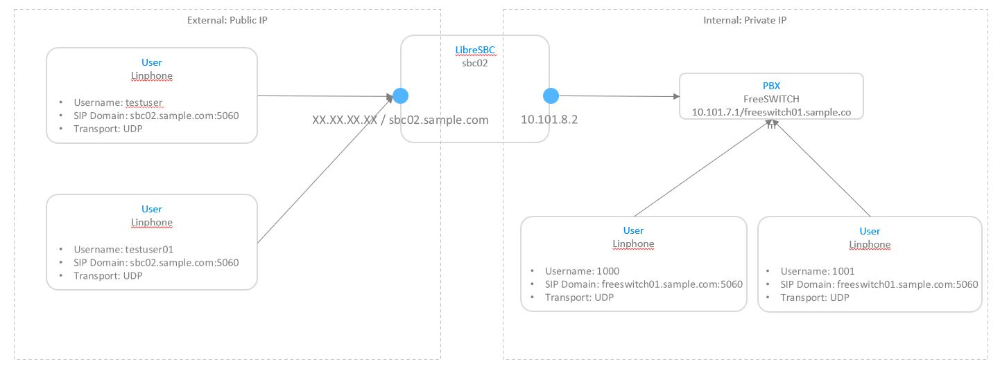

### Topology:

### LibreSBC

* Node: sbc02
* Public ip: XX.XX.XX.XX
* Internet DNS: sbc02.sample.com
* Private ip: 10.101.8.2

### PBX(FreeSWITCH)

* Using defaut configuration
* Default account: 1000-1019
* Internal: 10.101.7.1
* Internal DNS: freeswicth01.sample.com

### Internet user, (SIP Client, Linphone)

* Username: testuser, testuser01
* SIP Domain: sbc02.sample.com:5060
* Transport: UDP

### Internal user, (SIP Client, Linphone)

* Username: 1000, 1001
* SIP Domain: freeswicth01.sample.com:5060
* Transport: UDP

### test internal call between 2 ext 1000 and 1001

* It is ok.

### How to

Here are some summary steps need to be done on LibreSBC

1. Define cluster node, netalias
2. Define 2 SIP profile 1 for public and 1 for private
3. Define Media Class, Capacity Class
4. For Private IP (libresbc) ----> Private IP (FreeSWITCH as a PBX). = libreapi/interconnection/outbound + libreapi/base/gateway
5. Routing Table: /libreapi/routing/table with action=route and routes=<outbound-connection-in-step-4>
6. For Public-IP (User) ---> Public IP (libresbc) = libreapi/interconnection/inbound

### access config

* access_domain.json
* access_service.json
